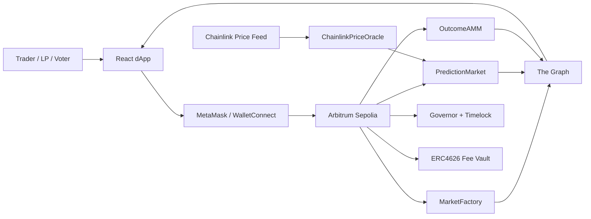
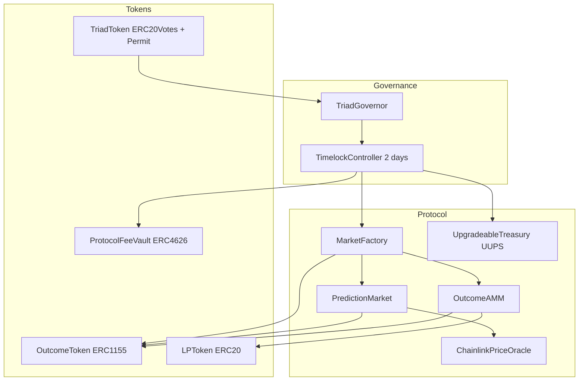
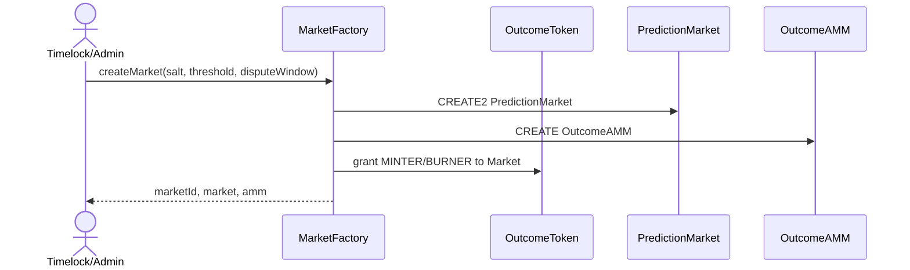
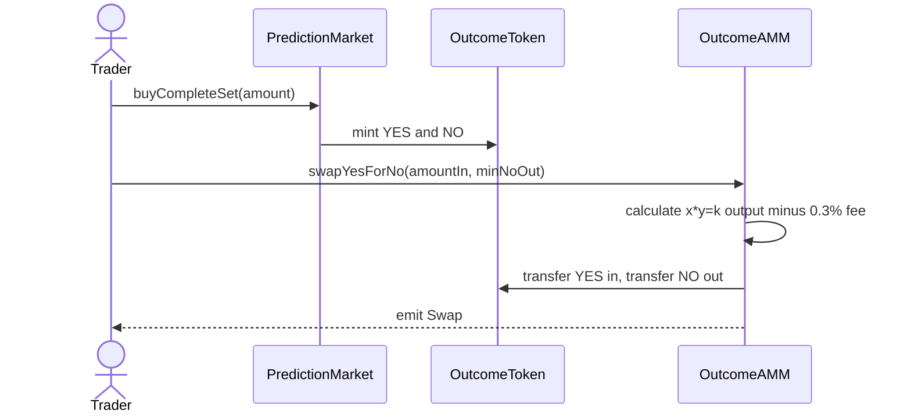
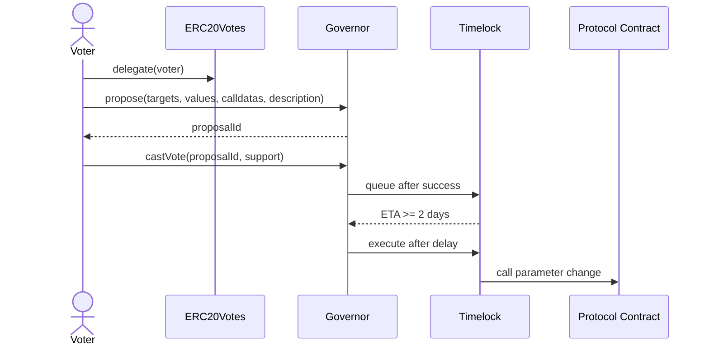

# TriadMarket Architecture and Design Document

**Project:** TriadMarket DAO-Governed Prediction Market  
**Scenario:** Option D — On-Chain Prediction Market  
**Team:** Mukhametkali Dias, Qaldyqan Yerzat, Rudov Andrew

## 1. Executive summary

TriadMarket is a binary outcome prediction market where users can tokenize opposing outcomes as ERC-1155 shares and trade them through a constant-product AMM. The protocol uses Chainlink price feeds for resolution, ERC-4626 for fee-vault accounting, and OpenZeppelin Governor with TimelockController for parameter governance. The project is built to demonstrate production engineering discipline: upgrade paths, explicit access control, event indexing, CI, automated tests, and security review.

The chosen scenario is an on-chain prediction market because it naturally integrates the course domains: token standards, AMM design, oracle security, governance, L2 deployment, indexing, and frontend UX. The MVP market asks whether a referenced Chainlink price will be above a threshold after a dispute window. The same architecture supports additional binary markets without changing the core contracts.

## 2. System context diagram — C4 Level 1

## 3. Container and component diagram

## 4. Critical flow 1 — market creation

Design notes: The factory demonstrates both CREATE and CREATE2. CREATE2 gives deterministic market addresses, which helps frontend and subgraph setup. Outcome token IDs are derived deterministically as `marketId * 2` and `marketId * 2 + 1`.

## 5. Critical flow 2 — trade through AMM

The AMM uses a constant-product curve with a 0.3% fee. Slippage protection is required through `minNoOut` or `minYesOut`. ReentrancyGuard is applied to all state-changing liquidity and swap functions.

## 6. Critical flow 3 — propose, vote, queue, execute

The Governor parameters are set to the project specification: voting delay 1 day, voting period 1 week, quorum 4%, proposal threshold 1%, and Timelock delay 2 days. Timelock controls treasury-level actions.

## 7. Storage layout

### TriadToken

- Inherits ERC20, ERC20Permit, ERC20Votes.
- No custom mutable storage except inherited token and vote checkpoint state.
- MAX_SUPPLY is constant and does not occupy a storage slot.

### OutcomeToken

- Inherits ERC1155 and AccessControl.
- Role mappings are stored by AccessControl.
- ERC1155 balances are keyed by token ID and owner.

### PredictionMarket

| Slot concept          | Variable                                                                   |
| --------------------- | -------------------------------------------------------------------------- |
| Immutable code values | collateral, outcomeToken, oracle, yesId, noId, threshold, disputeWindowEnd |
| Mutable state         | state, winningYes, totalCollateralLocked                                   |

Immutable variables are embedded in bytecode and cannot collide with upgradeable storage. The market is intentionally non-upgradeable because each market should be immutable after creation.

### OutcomeAMM

| Slot concept         | Variable                                       |
| -------------------- | ---------------------------------------------- |
| Immutable references | collateral, outcomeToken, lpToken, yesId, noId |
| Reserve state        | yesReserve, noReserve, accumulatedFees         |
| Access control       | inherited AccessControl role data              |

### ProtocolFeeVault

- Inherits ERC4626 and ERC20 share accounting.
- AccessControl stores pauser/strategist roles.
- No custom asset accounting is duplicated beyond ERC4626 functions.

### UpgradeableTreasury V1 -> V2

V1 defines `_accountedBalance` and a 49-slot storage gap. V2 adds no new storage except emitted event logic and uses the inherited mapping. The storage gap prevents future collision. V2 changes behavior only by adding `correctAccounting`, restricted to TREASURER_ROLE.

## 8. Access-control model

| Component           | Privileged role              | Authority                                        |
| ------------------- | ---------------------------- | ------------------------------------------------ |
| MarketFactory       | MARKET_CREATOR_ROLE          | Create markets                                   |
| OutcomeToken        | MINTER_ROLE/BURNER_ROLE      | Mint/burn outcome shares                         |
| PredictionMarket    | RESOLVER_ROLE/PAUSER_ROLE    | Resolve or cancel market                         |
| ProtocolFeeVault    | PAUSER_ROLE                  | Pause deposits/withdrawals                       |
| UpgradeableTreasury | UPGRADER_ROLE/TREASURER_ROLE | Upgrade implementation, withdraw accounted funds |
| Timelock            | PROPOSER/CANCELLER           | Queue and execute governance actions             |

The target production design transfers admin powers to Timelock. Individual EOAs should not retain critical admin roles after deployment.

## 9. Trust assumptions

1. Chainlink feed data is assumed to be correct if it is fresh and positive.
2. The Timelock is trusted to execute only successful governance proposals.
3. Token holders are assumed to vote independently; the protocol includes quorum and proposal thresholds to reduce spam.
4. Frontend is not trusted. All protocol checks are enforced in contracts.
5. The initial deployer is trusted only during deployment. Post-deployment verification checks remove direct admin backdoors.

## 10. Design decision records

### ADR-01: Constant-product AMM instead of LMSR

Context: The rubric requires AMM pricing.  
Options: LMSR, CPMM.  
Decision: CPMM because it is easier to test with invariants.  
Consequence: Liquidity can be shallow near extremes, so UI must warn about slippage.

### ADR-02: ERC1155 for outcome shares

Context: Every market needs YES and NO tokens.  
Options: ERC20 pair per market, ERC1155 IDs.  
Decision: ERC1155 because token IDs scale better across many markets.  
Consequence: Frontend must handle `setApprovalForAll` and token ID display.

### ADR-03: Timelock owns treasury permissions

Context: The rubric requires treasury under governance.  
Decision: Timelock is the final authority for treasury-level operations.  
Consequence: Emergency operations are slower but more transparent.

### ADR-04: UUPS only for treasury

Context: Markets should be immutable, but treasury policy may evolve.  
Decision: Upgrade only the treasury through UUPS.  
Consequence: Lower upgrade risk for market logic while still satisfying upgradeability.

### ADR-05: Oracle adapter abstraction

Context: Direct feed calls spread staleness logic.  
Decision: A dedicated `ChainlinkPriceOracle` validates positivity, round completeness, and freshness.  
Consequence: All market resolution uses the same oracle safety checks.
